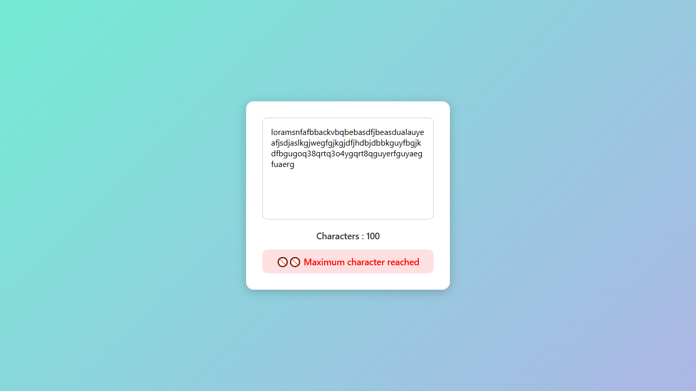

# ✨ Character Counter App

A clean and responsive JavaScript character counter that tracks the number of characters (excluding spaces) typed in a textarea. It warns users when they reach the maximum limit of 100 characters and prevents further input automatically.

---

## 🚀 Features

- ✅ Real-time character count update
- ❌ Ignores blank spaces in count
- 🚫 Displays warning when 100-character limit is reached
- 🔒 Disables input beyond 100 characters
- 📱 Fully responsive and mobile-friendly
- 🎨 Modern UI with gradient background and clean styling

---

## 📸 Preview

---

## 📂 Folder Structure

---

## 🛠️ How It Works

- User types in a `<textarea>`.
- JavaScript listens for every input.
- Spaces are removed from the count using `.split(" ").join("")`.
- When the count reaches 100:
  - A warning is displayed.
  - The textarea becomes read-only.
- When characters are removed and count drops below 100:
  - The textarea is unlocked.
  - The warning disappears.

---

## 📱 Responsive Design

The layout adjusts for small screens, making it fully usable on smartphones and tablets. The input box and messages scale smoothly across screen sizes.

---

## 💡 Future Improvements

- Add word count
- Support for emojis and special characters
- Light/Dark theme toggle
- Save typed text to local storage

---

## 🧑‍💻 Author

Made with ❤️ by Praduman Gupta (https://github.com/C-W-Praduman)

---

